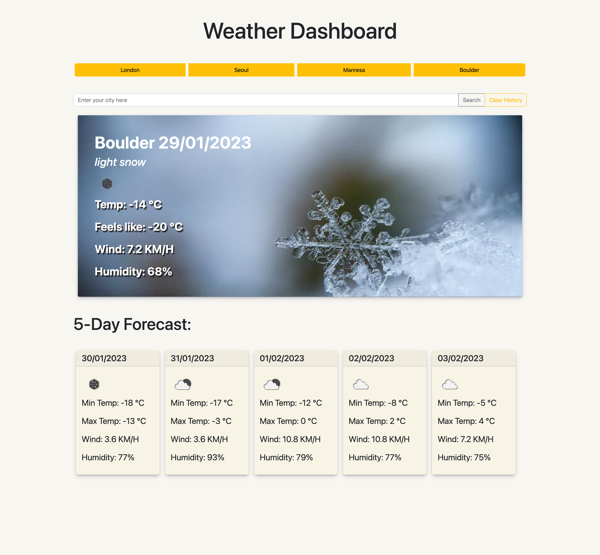

# Weather forecast Dashboard

<a href="https://github.com/berta-rf/forecast-dashboard/blob/main/LICENSE"></a>

## Table of contents

- [About the project](#about)
  - [User Story](#user-story)
  - [Screenshot](#screenshot)
  - [Links](#links)
- [My process](#my-process)
  - [Built with](#built-with)
  - [Useful resources](#useful-resources)
- [Author](#author)
- [License](#license)
- [Contributing](#contributing)

## About the project

This app is a Weather Dashboard with search by city input, that uses the OpenWeather API to retrieve current weather and 5-day forecast data, and uses `localStorage` to store persistent data.

Functionality:

  * When a user searches for a city they are presented with current and future conditions for that city and that city is added to the search history bar.
  * If the city is not found, show an alert message to the user.
  * When a user views the current weather conditions for that city they are presented with:
    * The city name and the date
    * An icon representation and background image of weather conditions
    * The temperature and Feels like
    * The humidity
    * The wind speed
  * When a user views future weather conditions for that city they are presented with a 5-day forecast that displays:
    * The date
    * An icon representation of weather conditions
    * The min and max temperatures
    * The wind speed
    * The humidity
  * When a user clicks on a city in the search history bar they are again presented with current and future conditions for that city

### User Story

```md
AS A traveler,
I WANT to see the weather outlook for multiple cities,
SO THAT I can plan a trip accordingly.
```

### Screenshot

The following image shows the web application's appearance and functionality:


### Links

- Repository URL: [https://github.com/berta-rf/forecast-dashboard](https://github.com/berta-rf/forecast-dashboard)
- Live Site URL: [https://berta-rf.github.io/forecast-dashboard](https://berta-rf.github.io/forecast-dashboard)

## My process

### Built with

- OpenWeather API
- jQuery
- Luxon
- JavaScript
- HTML
- CSS
- Bootstrap

### Useful resources

- [How to Handle Unsuccessful Fetch API Calls in JavaScript](https://javascript.plainenglish.io/handling-unsuccessful-calls-of-fetch-api-7eef551b74c8)
- [MDN docs on statements throw & catch](https://developer.mozilla.org/en-US/docs/Web/JavaScript/Reference/Statements/throw)
- [Luxon API docs](https://moment.github.io/luxon/api-docs/index.html#datetimenow)
- [Article on localStorage](https://blog.logrocket.com/localstorage-javascript-complete-guide/#howdoeslocalstoragework)
- [OpenWeather API docs](https://openweathermap.org/api/one-call-3)
- [Unsplash (weather conditions images)](https://unsplash.com/)

## Author

- Berta Romano Fernandez [bertaromanofernandez@gmail.com](mailto:bertaromanofernandez@gmail.com)
- GitHub [berta-rf](https://github.com/berta-rf)
- LinkedIn [Berta Romano Fernandez](https://www.linkedin.com/in/berta-romano-fernandez-85a51117a/)
- Frontend Mentor [@berta-rf](https://www.frontendmentor.io/profile/)

## License

Distributed under the **MIT license**. See [`LICENSE`](LICENSE) for more information.

## Contributing

Contributions are what make the open source community such an amazing place to learn, inspire, and create. Any contributions you make are **greatly appreciated**.

If you have a suggestion that would make this better, please fork the repo and create a pull request. You can also simply open an issue with the tag "enhancement".
Don't forget to give the project a star! Thanks again!

1. Fork the Project
2. Create your Feature Branch (`git checkout -b feature/AmazingFeature`)
3. Commit your Changes (`git commit -m 'Add some AmazingFeature'`)
4. Push to the Branch (`git push origin feature/AmazingFeature`)
5. Open a Pull Request
